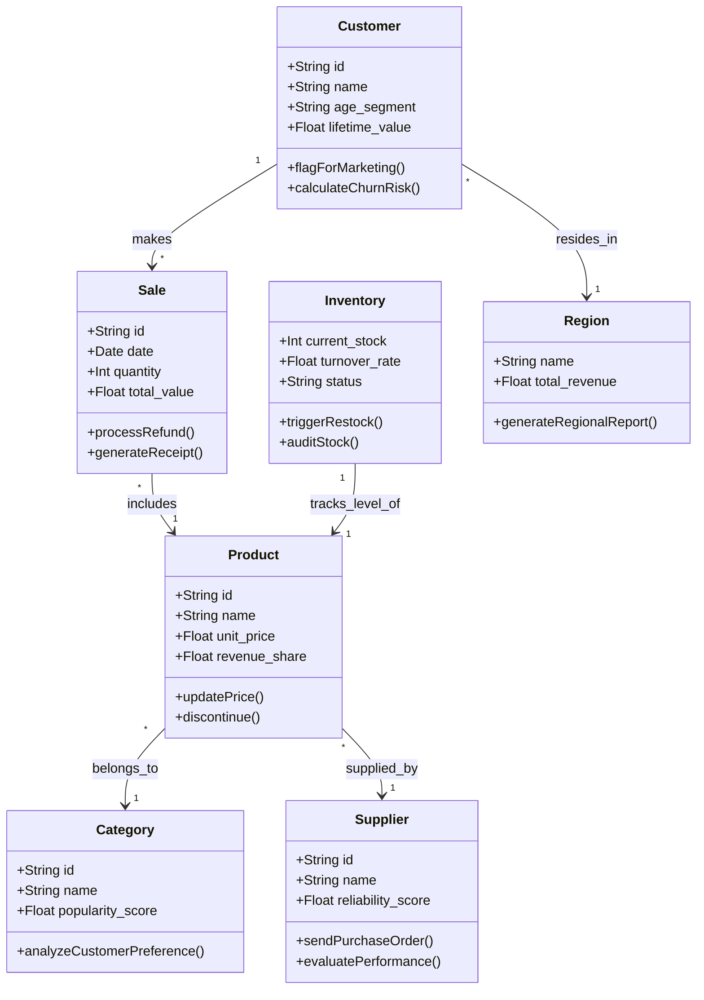

## 1. Ontology (Conceptual Model)
For this challenge, I designed the ontology inspired by the Palantir Foundry ecosystem. Instead of a traditional Entity-Relationship Diagram (ERD) focused strictly on database storage (foreign keys and strict cardinalities), I built a Semantic Model.

This approach maps the real-world domain into a Knowledge Graph consisting of Objects (entities), Properties (attributes/metrics), Actions (business operations), and Links (semantic connections).

#### The visual model:

#### Architecture and Semantic Links Rationale
To ensure the ontology supports the required business insights, I established the following logical paths:

* The Transactional Core (The "Fact"): * `Customer ➔ Sale (makes) and Sale ➔ Product (includes)`.
  * **Why**: This path directly answers "Who buys what, when, and for how much". It places the Sale object as the central event connecting the agent (Customer) to the asset (Product).

* Discovering Customer Affinity: * `Product ➔ Category (belongs_to)`.
    * **Why**: There is no direct link between a Customer and a Category. Instead, the system deduces preferences by traversing the graph: it identifies the Customer, evaluates their Sales, looks at the included Products, and finally checks their Categories. This is essential for generating insights like *"Young customers concentrate purchases in Fashion"*.

* Decoupling Physical State from Catalog: * `Inventory ➔ Product (tracks_level_of)`.
    * **Why**: A core data engineering best practice is separating static descriptive data from highly volatile state data. The product catalog (name, price) remains static, while the inventory (current stock, turnover rate) mutates with every transaction.

* Strategic Dimensions (Regions & Suppliers):
    * `Customer ➔ Region (resides_in)` and `Product ➔ Supplier (supplied_by)`.
    * **Why**: I elevated Regions and Suppliers from simple string columns to dedicated Objects. This ensures referential integrity for geographic grouping (crucial for the *"revenue by region"* metric) and opens up advanced supply chain analysis capabilities.

## 2. How to Run the Project

This project is structured into three main layers: a Python-based Data Pipeline (ETL), a Node.js API, and a React frontend. To run the full application locally, follow the steps below.

### Prerequisites
- Python 3.10+
- Node.js 18+
- npm

### 1. Install dependencies
At the project root (for ETL):

```bash
pip install -r requirements.txt
```

For the backend:

```bash
cd backend
npm install
```

For the frontend:

```bash
cd frontend
npm install
```

### 2. Generate base files and insights
From the project root, run:

```bash
python data_generator.py
python etl_pipeline.py
```

This will generate:
- Base CSV files in base_files
- Dashboard metrics JSON in insight_files/dashboard_metrics.json

### 3. Start the backend API
From the backend folder:

```bash
cd backend
npm run dev
```

The API runs on port 3001

### API Documentation
Base URL: http://localhost:3001

- GET /api/status
    - Health check endpoint
    - Returns a simple status payload to confirm the API is up

- GET /api/sales-by-region
    - Exposes aggregated revenue grouped by region
    - Used by the revenue chart in the dashboard

- GET /api/top-products
    - Exposes the top-selling products (by quantity sold)
    - Used by the products ranking/podium components

- GET /api/sales-by-category
    - Exposes total sales value grouped by product category
    - Used by the category distribution chart

- GET /api/top-buyers
    - Exposes the highest-value customers based on total purchase value
    - Used by top buyers ranking and customer insight widgets

- GET /api/recent-sales
    - Exposes the most recent sales transactions with enriched fields for table visualization
    - Used by the Recent Sales table and quick operational monitoring

### 4. Start the frontend
In another terminal:

```bash
cd frontend
npm run dev
```

The app is usually available at http://localhost:5173

## 3. Business Insights

By analyzing the data points and cross-referencing the different widgets on the dashboard (Endpoints), several actionable business insights can be derived:

### 1. Volume vs. Revenue (Category x Top Products)
Analysis: The Sales by Category chart shows that Groceries is the leader in revenue (R\$ 1.10M). However, the Top 5 Products podium (ordered by volume) is entirely dominated by items from the Home (Bookshelves, Microwaves, Vacuums) and Toys (Puzzles, Kites) categories.

Actionable Insight: The Groceries category generates massive revenue through the long tail effect (many different products selling consistently), while Home and Toys rely on a few blockbuster high-volume items. The company should implement cross-selling campaigns, offering grocery discounts at checkout for customers purchasing these top-tier Home and Toy products.

### 2. Top opportunities in secondary regions (Regions x Top Buyers)
Analysis: The East region leads the overall global revenue (R\$ 818k). Yet, the highest-spending customer, Cynthia Vasquez (R\$ 16.6k), belongs to the North region, which ranks 4th in total sales, and the East have just one top buyer in the Top5 rank.

Actionable Insight: The East region sustains itself on a large volume of regular customers, but the North and West hold extremely high-value VIP buyers. Marketing should focus on mass acquisition in the East, but pivot to Premium/VIP retention and lookalike audience targeting in the North and West to find new Cynthias.

### 3. The South region's purchasing behavior (Regions x Recent Sales)
Analysis: The South region generates the lowest total revenue (R\$ 672k). However, filtering the Recent Sales table reveals that the South is responsible for massive individual purchases (e.g., Sandra Martinez spent R\$ 4,906 on building blocks, and Tiffany Wilson spent R\$ 1,547 on gaming consoles in a single transaction).

Actionable Insight: The South lacks purchase frequency but boasts an exceptionally high Average Order Value (AOV), indicating potential B2B, wholesale, or institutional buyers (like schools). The strategy here should pivot away from daily retail promotions toward wholesale campaigns and high-ticket electronics.

### 4. Demographic segmentation by Region (Top Buyers x Tooltips)
Analysis: Observing the enriched Top Buyers podium, there is a clear demographic divide. The top buyers globally (Cynthia, Christina, Darryl) range from 38 to 50 years old and dominate the North, East, and West. Conversely, the top buyers in the Central region (Diamond and Robert) are significantly younger (32 and 20 years old).

Actionable Insight: The recommendation engine and ad creatives must be geographically personalized. Campaigns in the Central region should utilize Gen Z and Millennial-focused language and trends, while the rest of the regions should be targeted with family-oriented and Gen X-tailored messaging.

### 5. Revitalizing high-ticket Categories (Category x Recent Sales)
Analysis: Fashion (R\$ 283k) and Electronics (R\$ 362k) are the worst-performing categories in total volume. Despite this, the Recent Sales data shows that individual electronic items (Smartwatches, Routers, Laptops) generate robust individual invoices due to their high unit price.

Actionable Insight: To salvage these two categories without discounting them heavily, the company must increase their visibility. They can introduce Buy and Save bundles (e.g., Buy the best-selling Home Bookshelf and unlock 30% off any Fashion or Electronics item) to leverage the high traffic of the Home category.
